**Run it**

```bash
pip install agno fastapi uvicorn pandas
export OPENAI_API_KEY=sk-...
python nestle_supply_chain_ai_stack.py          # interactive demo
# or API
uvicorn nestle_supply_chain_ai_stack:app --reload
```

*Replace the stub `CustomAPITools` and `AzureIoTTools` with real integrations when you wire up Google Maps, Open Charge Map, SAP, or Azure IoT Hub.*

## 📋 50-Agent Mesh – Roles & Quick Prompts

| Layer / Agent                   | Mode        | Key tools                          | Core duty                                                                             |
| ------------------------------- | ----------- | ---------------------------------- | ------------------------------------------------------------------------------------- |
| **Control-Tower Director**      | coordinate  | SlackTools                         | Delegates to every manager/team, compiles daily KPI digest, triggers sentinels        |
| **Demand-Mgr**                  | route       | SlackTools                         | Routes any “forecast / promo / spike” work to Demand-Forecast Team or its specialists |
| • Stat-Forecaster               | worker      | PandasTools                        | Baseline ARIMAX / Prophet 18-month forecast                                           |
| • Promo-Lift Analyst            | worker      | PandasTools                        | Adds promo uplifts & cannibalisation                                                  |
| • Social-Demand Sensor          | worker      | DuckDuckGoTools, GoogleSearchTools | Pushes demand-spike events from TikTok / X                                            |
| • Demand-S\&OP Synth            | worker      | —                                  | Reconciles unconstrained forecast with capacity                                       |
| **Production-Mgr**              | route       | SlackTools                         | Handles material, capacity, inventory & labour tasks                                  |
| • Material-Availability         | worker      | SAPTools                           | Checks RM/PM stocks                                                                   |
| • Capacity-Solver               | worker      | ORTools                            | Solves finite-cap mix integer model                                                   |
| • Shift-Sequencer               | worker      | ORTools                            | Generates line/shift pattern                                                          |
| • Inventory-Health Doctor       | worker      | PandasTools                        | Flags dead-stock, ageing, DOH                                                         |
| • Talent-Scheduler              | worker      | SAPTools                           | Aligns labour roster with revised plan                                                |
| **Green-Logistics Mgr**         | route       | SlackTools                         | All transport, CO₂, traffic & returns matters                                         |
| • Eco-Route Optimizer           | worker      | GoogleMapsTools, ORTools           | VRP solve with CO₂ as objective                                                       |
| • Traffic-Intel Agent           | worker      | GoogleMapsTools                    | Real-time delay / incident feed                                                       |
| • Construction-Monitor          | worker      | GoogleSearchTools                  | Scrapes roadworks horizon                                                             |
| • Fuel-Price Tracker            | worker      | PetrolAPITools                     | Daily fuel €/L map                                                                    |
| • Charge-Planner                | worker      | OpenChargeMapTools                 | Inserts EV charge stops                                                               |
| • Reverse-Logistics Agent       | worker      | ORTools                            | Optimises back-hauls & returns                                                        |
| **Procurement-Mgr**             | route       | SlackTools                         | Sourcing, supplier risk & cost                                                        |
| • Should-Cost                   | worker      | PandasTools                        | Predicts target price curve                                                           |
| • Supplier-Scorecard            | worker      | YFinanceTools                      | ESG & risk scoring                                                                    |
| • RFx Autobidder                | worker      | SlackTools                         | Auto-drafts RFQ messages                                                              |
| • Supplier-Diversity Tracker    | worker      | GoogleSearchTools                  | Tags POs with D\&I metrics                                                            |
| **Sustainability-Mgr**          | route       | SlackTools                         | CSR & packaging                                                                       |
| • Regen-Agri Monitor            | worker      | GoogleSearchTools                  | Tracks farmer KPI                                                                     |
| • Scope3 Calculator             | worker      | PandasTools                        | Product-level GHG footprint                                                           |
| • Packaging-Optimizer           | worker      | DuckDuckGoTools                    | Suggests lighter/mono-material swaps                                                  |
| **Risk-Mgr (Sentinel)**         | route       | SlackTools                         | Collates alerts to QA & Exec                                                          |
| • Climate-Alert                 | worker      | GoogleSearchTools                  | Flood / drought trigger                                                               |
| • Geo-Political Alert           | worker      | GoogleSearchTools                  | Sanctions & strikes                                                                   |
| • Cyber-Supply Alert            | worker      | DuckDuckGoTools                    | Vendor cyber incidents                                                                |
| • IoT Anomaly Sentinel          | worker      | AzureIoTTools                      | Cold-chain temp/vibration excursion                                                   |
| **QA-Mgr**                      | route       | SlackTools                         | Reviews narrative, style, compliance                                                  |
| • Compliance-Reviewer           | worker      | —                                  | Rewrites off-brand text                                                               |
| **Finance-Mgr**                 | route       | SlackTools                         | Cost forecasting & carbon pricing                                                     |
| • Lane-Cost Forecaster          | worker      | PandasTools                        | €/ton-km vs. fuel & detours                                                           |
| • Carbon-Cost Oracle            | worker      | —                                  | Converts g CO₂ → € using EUA curve                                                    |
| **Scenario-Simulator Team**     | coordinate  | ORTools, FileTools                 | Generates what-if shocks, runs digital twin, outputs PPTX                             |
| • Generator / Runner / Reporter | workers     | —                                  | (3 workers inside)                                                                    |
| **Cost-Sentinel**               | collaborate | PandasTools                        | Rolls up token, km, € & CO₂ savings; posts #finops                                    |
| **Exception-Resolver**          | collaborate | SlackTools                         | Opens war-room when plan ≠ actual threshold                                           |

**Totals**

* 1 Executive
* 8 route-mode managers
* 7 coordinate teams (6 functional + Scenario)
* 2 collaborate sentinels
* 32 functional workers
* **50 agents in all**

---

## ⚡️ Example prompts (send to **Control-Tower Director**)

| Need                          | Prompt                                                                                            |
| ----------------------------- | ------------------------------------------------------------------------------------------------- |
| Re-plan transport for CO₂ cut | “Re-optimise next week’s German chilled lanes to save 5 % CO₂ and keep Friday OTIF.”              |
| Promo shock                   | “Marketing launched –25 % promo on KitKat Canada in July—show revised demand and capacity shift.” |
| Climate disruption            | “Brazil Pará floods reported: which cocoa suppliers are at risk and what’s our cost impact?”      |
| Packaging idea                | “Suggest mono-material swap for Nespresso outer box and estimate €/t and CO₂ delta.”              |
| Scenario                      | “Simulate a one-week strike at Trieste port; give mitigation lanes and incremental cost.”         |
| Fuel spike                    | “Diesel price +12 %: update lane-cost forecast and highlight worst 10 lanes.”                     |
| Documentation                 | “Outline full docs for our cold-chain optimisation, then write the API reference section.”        |

The director auto-routes to the right specialists; summaries flow back via Slack `#ctl_tower`, and Cost-Sentinel logs the savings.

```mermaid
flowchart TD
    %%  COLOR LEGEND
    classDef coord fill:#E4F4FF,stroke:#1E88E5
    classDef route fill:#FFF4E5,stroke:#FB8C00
    classDef collab fill:#E8F5E9,stroke:#43A047
    classDef worker fill:#FFFFFF,stroke:#9E9E9E,color:#555

    %% ───────────────── Executive layer ─────────────────
    CT["Control-Tower Director<br/>coordinate"]:::coord

    %% ───────────────── Route-mode managers ─────────────
    subgraph Route_Managers
        DMgr["Demand-Mgr"]:::route
        PMgr["Production-Mgr"]:::route
        LMgr["Green-Logistics Mgr"]:::route
        PrcMgr["Procurement-Mgr"]:::route
        SusMgr["Sustainability-Mgr"]:::route
        RMgr["Risk-Mgr"]:::route
        QAMgr["QA-Mgr"]:::route
        FMgr["Finance-Mgr"]:::route
    end
    CT --> Route_Managers

    %% ───────── Peer coordinate / collaborate containers ─────────
    ScenT["Scenario-Simulator<br/>coordinate"]:::coord
    CostSent["Cost-Sentinel<br/>collaborate"]:::collab
    ExRes["Exception-Resolver<br/>collaborate"]:::collab

    CT --> ScenT & CostSent & ExRes

    %% ───────────────── Demand-Forecast Team ────────────
    subgraph Demand_Forecast_Team["Demand-Forecast Team<br/>coordinate"]
        Stat["Stat-Forecaster"]:::worker
        Promo["Promo-Lift Analyst"]:::worker
        Social["Social-Demand Sensor"]:::worker
        S&OP["Demand-S&OP Synth"]:::worker
    end
    DMgr --> Demand_Forecast_Team

    %% ───────────────── Production-Plan Team ────────────
    subgraph Prod_Team["Production-Plan Team<br/>coordinate"]
        Mat["Material-Availability"]:::worker
        Cap["Capacity-Solver"]:::worker
        Shift["Shift-Sequencer"]:::worker
        Inv["Inventory-Doctor"]:::worker
        Talent["Talent-Scheduler"]:::worker
    end
    PMgr --> Prod_Team

    %% ───────────────── Green-Logistics Team ────────────
    subgraph Log_Team["Green-Logistics Team<br/>coordinate"]
        Eco["Eco-Route Optimizer"]:::worker
        Traff["Traffic-Intel"]:::worker
        Road["Construction Monitor"]:::worker
        Fuel["Fuel-Price Tracker"]:::worker
        Charge["Charge-Planner"]:::worker
        Rev["Reverse-Logistics"]:::worker
    end
    LMgr --> Log_Team

    %% ───────────────── Procurement-Ops Team ────────────
    subgraph Proc_Team["Procurement-Ops Team<br/>coordinate"]
        Cost["Should-Cost"]:::worker
        Score["Supplier-Scorecard"]:::worker
        RFx["RFx Autobidder"]:::worker
        Div["Supplier-Diversity"]:::worker
    end
    PrcMgr --> Proc_Team

    %% ───────────────── Sustainability Team ─────────────
    subgraph Sus_Team["Sustainability Team<br/>coordinate"]
        Regen["Regen-Agri Monitor"]:::worker
        Scope3["Scope 3 Calculator"]:::worker
        Pack["Packaging Optimizer"]:::worker
    end
    SusMgr --> Sus_Team

    %% ───────────────── Risk-Sentinel Team ──────────────
    subgraph Risk_Team["Risk-Sentinel Team<br/>coordinate"]
        Clim["Climate Alert"]:::worker
        Geo["Geo-Political Alert"]:::worker
        Cyber["Cyber Supply Alert"]:::worker
        IoT["IoT Anomaly Sentinel"]:::worker
    end
    RMgr --> Risk_Team

    %% ───────────────── QA / Governance ────────────────
    QAMgr --> QAworker["Compliance Reviewer"]:::worker

    %% ───────────────── Finance workers ────────────────
    subgraph Finance_Workers
        Lane["Lane-Cost Forecaster"]:::worker
        CO2["Carbon-Cost Oracle"]:::worker
    end
    FMgr --> Finance_Workers

    %% ───────────────── Scenario-Simulator workers ─────
    subgraph Scen_Workers
        GenW["Scenario Generator"]:::worker
        RunW["Scenario Runner"]:::worker
        RepW["Scenario Reporter"]:::worker
    end
    ScenT --> Scen_Workers
```




**How to read it**

* **Blue** nodes = `coordinate` team containers.
* **Orange** nodes = `route` managers that choose an internal specialist.
* **Green** nodes = `collaborate` sentinels that listen across the mesh.
* **White** nodes = individual worker agents.

This diagram covers **all 50 agents** in the Nestlé supply-chain AI stack we coded.

